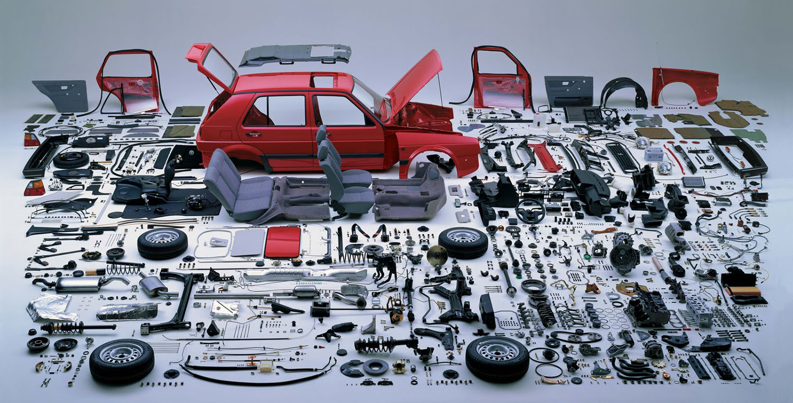

几乎所有前端框架都在玩“组件化”，而且最近都不约而同地选择了“标签化”这种思路，Angular 也不例外。

对新版本的 Angular 来说，一切都是围绕着“组件化”展开的，组件是 Angular 的核心概念模型。


## 组件的定义

以下是一个最简单的 Angular 组件定义：

```javascript
import { Component } from '@angular/core';

@Component({
  selector: 'app-root',
  templateUrl: './app.component.html',
  styleUrls: ['./app.component.css']
})
export class AppComponent {
  title = 'itcast';
}

```

- `@Component`：这是一个 Decorator（装饰器），其作用类似于 Java 里面的注解。Decorator 这个语言特性目前（2017-10）处于 Stage 2（草稿）状态，还不是 ECMA 的正式规范。
- `selector`：组件的标签名，外部使用者可以这样来使用这个组件：<app-root>。默认情况下，ng 命令生成出来的组件都会带上一个 app 前缀，如果你不喜欢，可以在 angular-cli.json 里面修改 prefix 配置项，设置为空字符串将会不带任何前缀。
- `templateUrl`：引用外部的 HTML 模板。如果你想直接编写内联模板，可以使用 template，支持 ES6 引入的[“模板字符串”写法](http://es6.ruanyifeng.com/#docs/string)。
- `styleUrls`：引用外部 CSS 样式文件，这是一个数组，也就意味着可以引用多份 CSS 文件。
- `export class AppComponent`：这是 ES6 里面引入的模块和 class 定义方式。


## 组件的模板

- 内联模板
- 模板文件

你可以在两种地方存放组件模板。 你可以使用`template`属性把它定义为*内联*的，或者把模板定义在一个独立的 HTML 文件中， 再通过`@Component`装饰器中的`templateUrl`属性， 在组件元数据中把它链接到组件。

无论用哪种风格，模板数据绑定在访问组件属性方面都是完全一样的。

具体模板语法请参考：[模板语法](#/template-syntax)

## 组件通信

## 组件声明周期

## 动态组件

## 内容分发

## 第三方组件库

